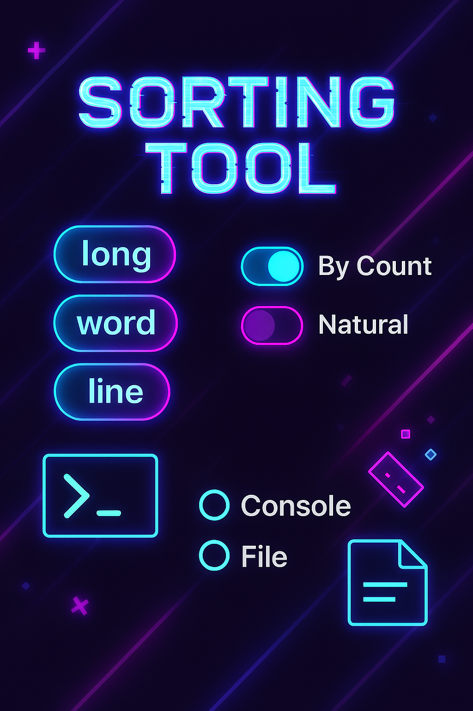

<div align=center>

# Chuck Norris Cipher Encoder

</div>

<p align=center>

</p>

#

<details>
<summary>German</summary>

###

Das ist ein Konsolenprogramm, welches mit diversen Argumenten zum Laufen gebracht werden muss. Es beherscht das Sortieren von Texteingabe, es kann Zeilen, Wörter oder Nummern sortieren. Es kann Eingaben über die Konsole oder über die Datei verarbeiten. Außerdem gibt es das Resultat direkt wieder in der Konsole aus oder schreibt das Ergebnis in eine Datei. Jeweils mit festgelegtem Namen. 

<div align=center>

## Zu der App
</div>

* ***Konsolen-Anwendung***
* ***Argumente:*** <code>-sortingType [natural, byCount]</code>, <code>-dataType [word, line, long]</code>, <code>-inputFile name</code>, <code>-outputFile name</code>
* lässt man <code>sortingType</code> weg, ist natural der Standardwert
* lässt man <code>dataType</code> weg, ist word der Standardwert
* lässt man <code>inputFile</code> weg, wird die Konsole als Standardeingabe genutzt
* lässt man <code>outputFile</code> weg, wird die Konsole als Standardausgabe genutzt
* wenn man <code>inputFile</code> angibt, aber die Datei nicht vorhanden ist, wird eine erstellt, aber die Ausgabe wird sein:
```
Total numbers: 0.
```
* Hat man sich für <code>byCount</code> als sortier typen entschieden, ist die Ausgabe Beispielhaft so:

```
Total numbers: 7.
-2: 1 time(s), 14%
4: 1 time(s), 14%
33: 1 time(s), 14%
42: 1 time(s), 14%
1: 3 time(s), 43%
```
und <code>natural</code> so:

```
Total numbers: 7.
Sorted data: -2 1 1 1 4 33 42
```
* wenn man das <code>outputFile</code> angibt und es nicht vorhanden ist, so wird es erstellt und beschrieben
<div align=center>

## Wie kann ich diese testen?
</div>

1.  Repository klonen:
    `git clone git@github.com:Dima0687/sorting-tool-with-java.git`
2.  In einer IDE öffnen (z.B. IntelliJ IDEA).
3.  Oben im rechten Bereich links neben dem *Play Button* ist ein kleiner Pfeil nach unten, diesen 
    drücken, anschließend auf <code>Add new run configuration</code> drücken und auf <code>Application</code>. Daraufhin aktualisiert sich das Fenster und man kann auf der rechten Seite oben den Namen angeben, einfach den Namen der Klasse angeben die aufgerufen wird. In diesem Fall <code>App</code>. Bei ***module not specified*** einfach die aktuellste Java Version auswählen, ich wähle hier <code>Java 23</code>. Bei ***-cp no module*** wähle ich <code>sorting-tool-with-java.main</code>. Unter ***Main class*** wähle ich <code>de.eisner.sorting.App</code>. Das alles ist nur deshalb nötig, damit man Programm Argumente eingeben kann.
    Unter ***Program arguments*** kann man nun die oben erwähnten Argumente z.B. <code>-sortingType byCount</code> eingeben, anschließend auf ***apply*** und auf ***OK*** oder direkt auf ***Run***. Hier muss man dann Wörter oder Nummern eingeben, je nachdem. Um das Programm zu stoppen drückt man nun <code>STRG + D</code> als EOF Signal.
4.  Die Klasse `App` im Paket `de.eisner.sorting` ausführen.

Als alternative kann man auch im Terminal zu dem ordner navigieren wo sich <code>App.java</code> befindet. Nun gibt man ein:
```
java App.java [optional: -sortingType [byCount|natural] -dataType [word|long|line] -inputFile name.typ z.B. test.txt -outputFile name.typ z.B. result.txt]
```
Gibt die gewünschten Daten ein und hier drückt man nun um das Programm zu beenden <code>STRG + Z</code> und anschließend <code>Enter</code>

<div align=center>

## Fazit

</div>

Das schwierigste an diesem Projekt war tatsächlich das vermeintlich einfache Strategy Pattern umzusetzen, vor allem da Generics im Spiel waren. Aber wie immer ist es toll etwas neues kennengelernt zu haben, mit jedem Projekt wird man besser und weiß mehr. Das freut mich sehr.
Das Projekt hat mir gezeigt, das ich noch zu wenig mit Generics gearbeitet habe und somit in diesem Punkt noch defizite habe, es ist wie immer, es ist das eine, es theoretisch zu verstehen und das andere, es am Ende praktisch anzuwenden.

</br>
</br>
</details>

<details open> 
<summary>English</summary>

This is a console program that must be run with various arguments. It supports sorting text input and can sort lines, words, or numbers. It can process input either from the console or from a file. In addition, it outputs the result directly to the console or writes the result to a file—each with a specified name.

<div align=center>

## About the App
</div>

* ***Console application***
* ***Arguments:*** <code>-sortingType [natural, byCount]</code>, <code>-dataType [word, line, long]</code>, <code>-inputFile name</code>, <code>-outputFile name</code>
* If <code>sortingType</code> is omitted, <code>natural</code> is the default value.
* If <code>dataType</code> is omitted, <code>word</code> is the default value.
* If <code>inputFile</code> is omitted, the console is used as the default input.
* If <code>outputFile</code> is omitted, the console is used as the default output.
* If <code>inputFile</code> is specified but the file does not exist, it will be created, but the 
  output will be:

```
Total numbers: 0.
```

* If <code>byCount</code> is selected as the sorting type, the output will look like this, for example:

```
Total numbers: 7.
-2: 1 time(s), 14%
4: 1 time(s), 14%
33: 1 time(s), 14%
42: 1 time(s), 14%
1: 3 time(s), 43%
```

and with <code>natural</code> it looks like this:

```
Total numbers: 7.
Sorted data: -2 1 1 1 4 33 42
```

* If <code>outputFile</code> is specified and it does not exist, it will be created and written to.

<div align=center>

## How can I test this?
</div>

1. Clone the repository:
  `git clone git@github.com:Dima0687/sorting-tool-with-java.git`
2. Open it in an IDE (e.g., IntelliJ IDEA). 
3. At the top right area, next to the *Play button*, there is a small downward arrow. 
   Click it, then select <code>Add new run configuration</code> and choose <code>Application</code>. The window will refresh, and you can enter a name at the top right—simply use the name of the class to be executed. In this case, <code>App</code>. For ***module not specified***, just select the latest Java version; here I choose <code>Java 23</code>. For ***-cp no module***, select <code>sorting-tool-with-java.main</code>. Under ***Main class***, choose <code>de.eisner.sorting.App</code>. 
   All of this is only necessary so that you can enter program arguments.
  Under ***Program arguments***, you can now enter the arguments mentioned above, e.g., <code>-sortingType byCount</code>, then click ***Apply*** and ***OK*** or directly ***Run***. You can then enter words or numbers as required. To stop the program, press <code>CTRL + D</code> to send the EOF signal.
4. Run the `App` class in the `de.eisner.sorting package`.

As an alternative, you can navigate in the terminal to the folder where <code>App.java</code> is located. Then enter:
```
java App.java [optional: -sortingType [byCount|natural] -dataType [word|long|line] -inputFile name.ext e.g. test.txt -outputFile name.ext e.g. result.txt]
```

Enter the desired data, and to terminate the program press <code>CTRL + Z</code> and then <code>Enter</code>.

<div align=center>

## Conclusion
</div>

The most challenging part of this project was actually implementing the supposedly simple Strategy pattern, especially since generics were involved. But as always, it is great to have learned something new—each project helps you improve and expand your knowledge, which makes me very happy.
The project showed me that I have not worked enough with generics yet and still have weaknesses in this area. As always, it is one thing to understand something in theory and another to apply it successfully in practice.

</br> 
</br> 
</details>